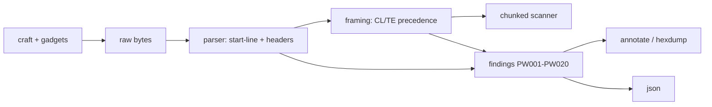

# plainwire

[English](README.md) | [中文](README.zh.md) | [日本語](README.ja.md)

[](LICENSE) [](Cargo.toml) [](tests) [](CONTRIBUTING.md)

**オープンソースの生 HTTP/1.1 ワークベンチ——やり取りをバイト単位で組み立て・解析し、Content-Length / Transfer-Encoding のスマグリング曖昧性を指摘する。**


```bash
git clone https://github.com/JaydenCJ/plainwire.git && cargo install --path plainwire
```

## なぜ plainwire なのか？

netcat は意味のないバイト列を見せるだけです。リクエストを貼り付ければ塊が返り、フレーミングの判断はすべて頭の中。curl は逆の問題で、何もかも正規化してしまうため、本当に送りたかった不正なメッセージがワイヤーに届きません。どちらも、HTTP フレーミングをキャリアに直結させたあの問題——リクエストスマグリング——には役立ちません。これは、1 つのメッセージが Content-Length と Transfer-Encoding を同時に持つ、ヘッダが重複する、`chunked` がタブの陰に隠れている、といった理由でフロントとバックが body の長さについて食い違う攻撃です。plainwire はまさにこのための「ガイド付き netcat」です。netcat が印字するのと同じバイト列をスタートライン・ヘッダ・フレーミング済み body に解析し、各要素に正確なバイトオフセットを保ち、RFC 9112 の body 長さ優先順位を適用し、「準拠した 2 つのパーサが異なる長さに到達しうる」箇所をすべて指摘します——それぞれに CI で grep できる安定コード付きで。メッセージの組み立ても行い、既知の desync ガジェットも含めて、書き手と読み手を一致させます。

|  | plainwire | netcat / socat | curl | http-parser 系 |
|---|---|---|---|---|
| 書いたバイトをそのまま送る | yes | yes | no（正規化する） | n/a |
| CL/TE の body フレーミングを解析 | yes | no | 隠蔽 | yes |
| CL.TE / TE.TE 曖昧性を指摘 | yes（`PW001`–`PW020`） | no | no | no |
| バイトオフセット注釈 | yes | no | no | no |
| desync ガジェットの生成 | yes（5 種内蔵） | 手作業 | no | no |
| ランタイム依存 | ゼロ（std のみ） | ゼロ | 多数 | 場合による |
| ネットワークソケットを開く | 決してない | 常に | 常に | 決してない |

<sub>依存数は 2026-07-12 に確認：plainwire の `[dependencies]` テーブルは空で、std のみの Rust クレートです。</sub>

## 特徴

- **すべてのバイトに意味を与える** —— パーサはスタートライン・ヘッダ・body を切り分け、各部分に正確なバイト範囲を保つため、`inspect` と `hexdump` はある finding が指す正確なバイトを示せます。
- **CL/TE の曖昧性に名前と位置を** —— 20 の安定コード（`PW001`–`PW020`）が both-CL-TE、重複・矛盾する Content-Length、重複／難読化された Transfer-Encoding、コロン前の空白、裸 LF 行末、旧式の折り返し、チャンク異常、末尾 body を網羅します。
- **狙ったバイトを正確に組み立てる** —— 本物の CRLF と自動 Content-Length またはチャンク body でリクエストを作るか、既知の desync ガジェット（`cl.te`・`te.cl`・`te.te`・`space-colon`・`bare-lf`）をそのまま netcat へ流します。
- **フレーミングのための CI ゲート** —— `--fail-on` 以上の finding があると `plainwire lint` は非ゼロで終了するため、収集したリクエスト群を自動で検査できます。
- **必要なときは機械可読で** —— `--json` は、手書きで依存ゼロのシリアライザを通して構造化解析全体（範囲・ヘッダ・body・findings）を出力します。
- **依存ゼロ・完全オフライン** —— バイトを読むだけでソケットを一切開かない std のみの Rust なので、収集した本番トラフィックに対しても安全に実行できます。

## クイックスタート

インストール（Rust 1.75+ が必要）：

```bash
git clone https://github.com/JaydenCJ/plainwire.git && cargo install --path plainwire
```

既知の CL.TE ガジェットを 1 本のパイプで組み立てて解析します：

```bash
plainwire craft --smuggle cl.te | plainwire inspect --request -
```

出力：

```text
plainwire — request, 3 header(s), 92 byte(s)

start-line  [0..15]
  method   POST
  target   /
  version  HTTP/1.1

headers (3)
  [17..35]  Host: example.test
  [37..54]  Content-Length: 6
  [56..82]  Transfer-Encoding: chunked

body  [86..91]
  framing   chunked
  decoded   0 byte(s)
  chunks    0
  complete  yes

framing: chunked (Transfer-Encoding wins; a Content-Length here would be ignored by a conforming server)

findings: 1 error(s), 1 warn(s), 0 info
  error  PW001  both-cl-te
         both Content-Length and Transfer-Encoding are present; conforming servers use chunked and ignore Content-Length
         at bytes 37..82
  warn   PW017  trailing-body-bytes
         1 byte(s) follow the chunked body (possible smuggled request prefix)
         at bytes 91..92
```

リクエスト群に対する CI ゲートとして使えます——`lint` が終了コードを決めます：

```bash
plainwire lint examples/cl-te-desync.http   # PW001 を出力して 1 で終了
plainwire lint examples/clean-post.http      # 「no framing ambiguities detected」、0 で終了
```

本ツールはソケットを一切開きません。組み立てたリクエストを実際に送るには、自分で netcat に流してください：`plainwire craft --smuggle cl.te | nc 127.0.0.1 80`。

## Finding コード

どの曖昧性にも安定した `PWnnn` コードが付きます（説明付きの全カタログは `plainwire codes` で表示）。

| コード | 深刻度 | 指摘する内容 |
|---|---|---|
| `PW001` | error | Content-Length と Transfer-Encoding が両方存在（CL.TE / TE.CL） |
| `PW002` | error | Content-Length ヘッダが複数 |
| `PW003` | error | Content-Length が矛盾する値に解決 |
| `PW004` | error | Transfer-Encoding ヘッダが複数（TE.TE） |
| `PW005` | error | Transfer-Encoding の末尾が `chunked` でない |
| `PW006` | error | 難読化された `chunked` 符号化（例：`xchunked`、タブの小細工） |
| `PW007` | error | ヘッダ名とコロンの間の空白 |
| `PW008` | warn | 行が CRLF でなく裸 LF で終端 |
| `PW009` | warn | 行内の裸 CR |
| `PW010` | error | Content-Length が非負整数のみでない |
| `PW011` | error | チャンクサイズが不正な 16 進／不整合 |
| `PW012` | info | チャンク拡張が存在 |
| `PW013` | warn | ヘッダ名に非 token バイト／コロンなし |
| `PW014` | warn | リクエスト行に余分な空白 |
| `PW015` | warn | Host ヘッダのない HTTP/1.1 リクエスト |
| `PW016` | error | Host ヘッダが複数 |
| `PW017` | warn | フレーミング済み body の後にバイトが残る |
| `PW018` | warn | body が宣言された長さより短い |
| `PW019` | warn | 旧式のヘッダ折り返し（obs-fold） |
| `PW020` | error | チャンク body に終端の 0 サイズチャンクがない |

## スマグリング ガジェット

`plainwire craft --smuggle <name>` は、自分のプロキシ連鎖を試すための最小で忠実な概念実証を出力します。

| ガジェット | 手口 | 組み立てる内容 |
|---|---|---|
| `cl.te` | フロントは Content-Length、バックは Transfer-Encoding | 両ヘッダ；`0` チャンクと 1 バイトの密輸分 |
| `te.cl` | フロントは Transfer-Encoding、バックは Content-Length | 両ヘッダ；短い CL が切り詰めるチャンク body |
| `te.te` | Transfer-Encoding を重複、片方を難読化 | 先に `Transfer-Encoding: xchunked`、次に `: chunked` |
| `space-colon` | コロン前に空白 | `Transfer-Encoding : chunked` と Content-Length を併置 |
| `bare-lf` | 裸 LF 行末 | `\r\n` でなく `\n` で終わる `Transfer-Encoding` 行 |

## アーキテクチャ



## ロードマップ

- [x] v0.1.0：バイト単位のパーサ、RFC 9112 のフレーミング優先順位、20 の finding コード、チャンクスキャナ、annotate/hexdump/json レンダラ、5 種の desync ガジェットを備えた craft、そして inspect/lint/hexdump/craft/codes の CLI（ユニット 80 + CLI 10 テスト + smoke.sh）
- [ ] コーパス/ファズモード：収集したリクエストのディレクトリを一括で lint
- [ ] レスポンス側の desync ヒューリスティック（宣言長 vs 実際の body）
- [ ] pcap / HAR インポートで、抽出せずに収集データを解析
- [ ] HTTP/2 `h2c` アップグレードとダウングレードのフレーミング認識
- [ ] ライブラリ API の安定化と crates.io リリース

全リストは [open issues](https://github.com/JaydenCJ/plainwire/issues) を参照してください。

## コントリビュート

コントリビュート歓迎です——[CONTRIBUTING.md](CONTRIBUTING.md) を参照し、[good first issue](https://github.com/JaydenCJ/plainwire/issues?q=is%3Aissue+is%3Aopen+label%3A%22good+first+issue%22) から始めるか、[discussion](https://github.com/JaydenCJ/plainwire/discussions) を立ててください。

## ライセンス

[MIT](LICENSE)
