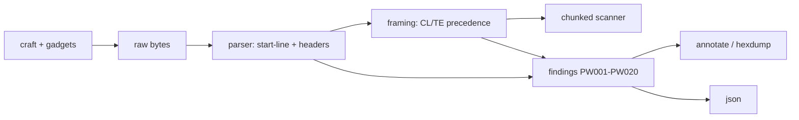

# plainwire

[English](README.md) | [中文](README.zh.md) | [日本語](README.ja.md)

[](LICENSE) [](Cargo.toml) [](tests) [](CONTRIBUTING.md)

**Open-source raw HTTP/1.1 workbench — craft and inspect exchanges byte-by-byte, flagging Content-Length / Transfer-Encoding smuggling ambiguities.**


```bash
git clone https://github.com/JaydenCJ/plainwire.git && cargo install --path plainwire
```

## Why plainwire?

netcat shows you bytes with no meaning: you paste a request, you get a blob back, and every framing decision is in your head. curl is the opposite problem — it normalizes everything, so the malformed message you actually wanted to send never reaches the wire. Neither helps with the thing that made HTTP framing career-relevant: request smuggling, where a front-end and a back-end disagree about how long a body is because a message carries both Content-Length and Transfer-Encoding, or a duplicated header, or a `chunked` coding hidden behind a tab. plainwire is the guided netcat for exactly this. It parses the same bytes netcat prints into a start-line, headers and a framed body, keeps an exact byte offset for every element, applies the RFC 9112 body-length precedence, and names every point where two conforming parsers could reach different lengths — with a stable finding code you can grep for in CI. It also crafts the messages, including known desync gadgets, so the write side and the read side agree.

|  | plainwire | netcat / socat | curl | http-parser libs |
|---|---|---|---|---|
| Sends the exact bytes you wrote | yes | yes | no (normalizes) | n/a |
| Parses CL/TE body framing | yes | no | hidden | yes |
| Flags CL.TE / TE.TE ambiguity | yes (`PW001`–`PW020`) | no | no | no |
| Byte-offset annotations | yes | no | no | no |
| Crafts desync gadgets | yes (5 built in) | by hand | no | no |
| Runtime dependencies | zero (std only) | zero | many | varies |
| Opens a network socket | never | always | always | never |

<sub>Dependency counts checked 2026-07-12: plainwire has an empty `[dependencies]` table; it is a std-only Rust crate.</sub>

## Features

- **Every byte gets a meaning** — the parser splits the start-line, headers and body and keeps an exact byte span for each, so `inspect` and `hexdump` point at the precise bytes a finding is about.
- **CL/TE ambiguities, named and located** — 20 stable finding codes (`PW001`–`PW020`) cover both-CL-TE, duplicate and conflicting Content-Length, duplicate/obfuscated Transfer-Encoding, whitespace-before-colon, bare LF endings, obsolete folding, chunk anomalies and trailing bodies.
- **Craft the exact bytes you mean** — build a request with real CRLFs and an auto Content-Length or chunked body, or emit a known desync gadget (`cl.te`, `te.cl`, `te.te`, `space-colon`, `bare-lf`) straight into netcat.
- **A CI gate for framing** — `plainwire lint` exits non-zero when a finding at or above `--fail-on` is present, so a corpus of captured requests can be checked automatically.
- **Machine-readable on demand** — `--json` emits the whole structural analysis (spans, headers, body, findings) through a hand-rolled, dependency-free serializer.
- **Zero dependencies, fully offline** — std-only Rust that reads bytes and never opens a socket, so it is safe to run against captured production traffic.

## Quickstart

Install (requires Rust 1.75+):

```bash
git clone https://github.com/JaydenCJ/plainwire.git && cargo install --path plainwire
```

Craft a known CL.TE gadget and inspect it in one pipe:

```bash
plainwire craft --smuggle cl.te | plainwire inspect --request -
```

Output:

```text
plainwire — request, 3 header(s), 92 byte(s)

start-line  [0..15]
  method   POST
  target   /
  version  HTTP/1.1

headers (3)
  [17..35]  Host: example.test
  [37..54]  Content-Length: 6
  [56..82]  Transfer-Encoding: chunked

body  [86..91]
  framing   chunked
  decoded   0 byte(s)
  chunks    0
  complete  yes

framing: chunked (Transfer-Encoding wins; a Content-Length here would be ignored by a conforming server)

findings: 1 error(s), 1 warn(s), 0 info
  error  PW001  both-cl-te
         both Content-Length and Transfer-Encoding are present; conforming servers use chunked and ignore Content-Length
         at bytes 37..82
  warn   PW017  trailing-body-bytes
         1 byte(s) follow the chunked body (possible smuggled request prefix)
         at bytes 91..92
```

Use it as a CI gate over a request corpus — `lint` sets the exit code:

```bash
plainwire lint examples/cl-te-desync.http   # prints PW001 and exits 1
plainwire lint examples/clean-post.http      # "no framing ambiguities detected", exits 0
```

The tool never opens a socket. To actually send a crafted request, pipe it into netcat yourself: `plainwire craft --smuggle cl.te | nc 127.0.0.1 80`.

## Finding codes

Every ambiguity has a stable `PWnnn` code (run `plainwire codes` for the full catalog with descriptions).

| Code | Severity | What it flags |
|---|---|---|
| `PW001` | error | Content-Length and Transfer-Encoding both present (CL.TE / TE.CL) |
| `PW002` | error | Multiple Content-Length header fields |
| `PW003` | error | Content-Length resolves to conflicting values |
| `PW004` | error | Multiple Transfer-Encoding header fields (TE.TE) |
| `PW005` | error | Transfer-Encoding does not end in `chunked` |
| `PW006` | error | Obfuscated `chunked` coding (e.g. `xchunked`, tab tricks) |
| `PW007` | error | Whitespace between a header name and its colon |
| `PW008` | warn | Line terminated by a bare LF instead of CRLF |
| `PW009` | warn | Bare CR inside a line |
| `PW010` | error | Content-Length is not a bare non-negative integer |
| `PW011` | error | Chunk size is not valid hexadecimal / is misaligned |
| `PW012` | info | Chunk extension present |
| `PW013` | warn | Header name has non-token bytes / no colon |
| `PW014` | warn | Extra whitespace in the request line |
| `PW015` | warn | HTTP/1.1 request without a Host header |
| `PW016` | error | Multiple Host header fields |
| `PW017` | warn | Bytes remain after the framed body |
| `PW018` | warn | Body is shorter than its declared length |
| `PW019` | warn | Obsolete header line folding (obs-fold) |
| `PW020` | error | Chunked body missing its terminating 0-size chunk |

## Smuggling gadgets

`plainwire craft --smuggle <name>` emits a minimal, faithful proof of concept for testing your own proxy chain.

| Gadget | Vector | What it builds |
|---|---|---|
| `cl.te` | Content-Length front-end, Transfer-Encoding back-end | both headers; a `0`-chunk plus one smuggled byte |
| `te.cl` | Transfer-Encoding front-end, Content-Length back-end | both headers; a chunked body a short CL truncates |
| `te.te` | duplicate Transfer-Encoding, one obfuscated | `Transfer-Encoding: xchunked` then `: chunked` |
| `space-colon` | whitespace before the colon | `Transfer-Encoding : chunked` beside a Content-Length |
| `bare-lf` | bare LF line ending | a `Transfer-Encoding` line ended with `\n`, not `\r\n` |

## Architecture



## Roadmap

- [x] v0.1.0: byte-level parser, RFC 9112 framing precedence, 20 finding codes, chunked scanner, annotate/hexdump/json renderers, craft with five desync gadgets, and the inspect/lint/hexdump/craft/codes CLI (80 unit + 10 CLI tests + smoke.sh)
- [ ] Corpus/fuzz mode that lints a directory of captured requests in one pass
- [ ] Response-side desync heuristics (declared vs actual body on responses)
- [ ] pcap / HAR import so captures can be inspected without extraction
- [ ] HTTP/2 `h2c` upgrade and downgrade framing awareness
- [ ] Library API stabilization and a crates.io release

See the [open issues](https://github.com/JaydenCJ/plainwire/issues) for the full list.

## Contributing

Contributions are welcome — see [CONTRIBUTING.md](CONTRIBUTING.md), start with a [good first issue](https://github.com/JaydenCJ/plainwire/issues?q=is%3Aissue+is%3Aopen+label%3A%22good+first+issue%22) or open a [discussion](https://github.com/JaydenCJ/plainwire/discussions).

## License

[MIT](LICENSE)
