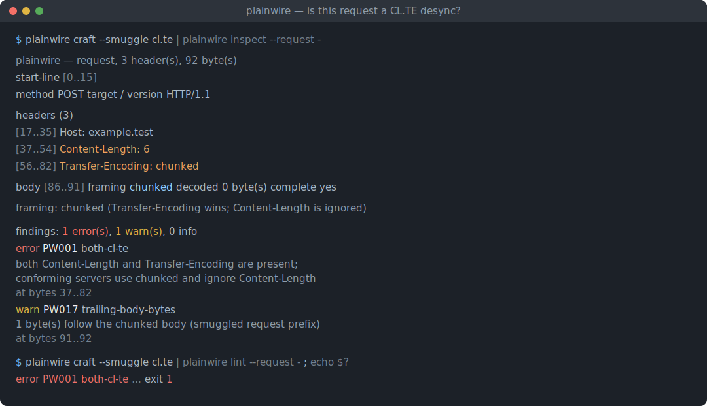
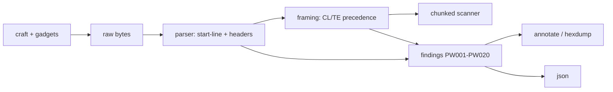

# plainwire

[English](README.md) | [中文](README.zh.md) | [日本語](README.ja.md)

[](LICENSE) [](Cargo.toml) [](tests) [](CONTRIBUTING.md)

**开源的原始 HTTP/1.1 工作台——逐字节构造与解析报文，标记 Content-Length / Transfer-Encoding 走私歧义。**



```bash
git clone https://github.com/JaydenCJ/plainwire.git && cargo install --path plainwire
```

## 为什么选择 plainwire？

netcat 只给你没有含义的字节：粘一个请求进去，回来一坨数据，所有分帧判断都在你脑子里。curl 则是相反的问题——它把一切都规范化了，于是你真正想发出的那条畸形报文根本到不了线上。两者都帮不上让 HTTP 分帧变得与职业相关的那件事：请求走私——前端和后端因为一条报文同时带着 Content-Length 和 Transfer-Encoding、或重复了某个头、或把 `chunked` 藏在制表符后面，而对 body 有多长产生分歧。plainwire 正是为此而生的「带向导的 netcat」。它把 netcat 打印的同一批字节解析成起始行、头部和分帧后的 body，为每个元素保留精确的字节偏移，套用 RFC 9112 的 body 长度优先级，并标出每一个「两个合规解析器可能得出不同长度」的位置——每处都配一个可在 CI 里 grep 的稳定编号。它还能构造这些报文，包括已知的 desync gadget，让写侧与读侧保持一致。

|  | plainwire | netcat / socat | curl | http-parser 库 |
|---|---|---|---|---|
| 原样发送你写的字节 | yes | yes | no（会规范化） | n/a |
| 解析 CL/TE body 分帧 | yes | no | 隐藏 | yes |
| 标记 CL.TE / TE.TE 歧义 | yes（`PW001`–`PW020`） | no | no | no |
| 字节偏移标注 | yes | no | no | no |
| 构造 desync gadget | yes（内置 5 种） | 手动 | no | no |
| 运行时依赖 | 零（仅 std） | 零 | 很多 | 视情况 |
| 打开网络套接字 | 从不 | 总是 | 总是 | 从不 |

<sub>依赖数量核对于 2026-07-12：plainwire 的 `[dependencies]` 表为空；它是仅依赖 std 的 Rust crate。</sub>

## 特性

- **每个字节都有含义** —— 解析器拆出起始行、头部和 body，并为每个部分保留精确的字节区间，因此 `inspect` 和 `hexdump` 能准确指向某条 finding 所对应的字节。
- **CL/TE 歧义：命名并定位** —— 20 个稳定编号（`PW001`–`PW020`）覆盖 both-CL-TE、重复与冲突的 Content-Length、重复/混淆的 Transfer-Encoding、冒号前空白、裸 LF 行尾、过时折行、分块异常与尾随 body。
- **精确构造你想要的字节** —— 用真实 CRLF 与自动 Content-Length 或分块 body 构造请求，或直接把一个已知 desync gadget（`cl.te`、`te.cl`、`te.te`、`space-colon`、`bare-lf`）送进 netcat。
- **面向分帧的 CI 门禁** —— 当出现达到或超过 `--fail-on` 级别的 finding 时，`plainwire lint` 以非零码退出，于是一批抓包请求可被自动校验。
- **需要时给机器读** —— `--json` 通过一个手写、零依赖的序列化器输出完整的结构化分析（区间、头部、body、findings）。
- **零依赖、完全离线** —— 仅依赖 std 的 Rust，只读字节、从不打开套接字，因此可以安全地跑在抓来的生产流量上。

## 快速上手

安装（需要 Rust 1.75+）：

```bash
git clone https://github.com/JaydenCJ/plainwire.git && cargo install --path plainwire
```

用一条管道构造一个已知的 CL.TE gadget 并解析它：

```bash
plainwire craft --smuggle cl.te | plainwire inspect --request -
```

输出：

```text
plainwire — request, 3 header(s), 92 byte(s)

start-line  [0..15]
  method   POST
  target   /
  version  HTTP/1.1

headers (3)
  [17..35]  Host: example.test
  [37..54]  Content-Length: 6
  [56..82]  Transfer-Encoding: chunked

body  [86..91]
  framing   chunked
  decoded   0 byte(s)
  chunks    0
  complete  yes

framing: chunked (Transfer-Encoding wins; a Content-Length here would be ignored by a conforming server)

findings: 1 error(s), 1 warn(s), 0 info
  error  PW001  both-cl-te
         both Content-Length and Transfer-Encoding are present; conforming servers use chunked and ignore Content-Length
         at bytes 37..82
  warn   PW017  trailing-body-bytes
         1 byte(s) follow the chunked body (possible smuggled request prefix)
         at bytes 91..92
```

把它当作请求语料上的 CI 门禁——`lint` 决定退出码：

```bash
plainwire lint examples/cl-te-desync.http   # 打印 PW001 并以 1 退出
plainwire lint examples/clean-post.http      # 「no framing ambiguities detected」，以 0 退出
```

本工具从不打开套接字。要真正发出构造好的请求，请自行用 netcat 接管：`plainwire craft --smuggle cl.te | nc 127.0.0.1 80`。

## Finding 编号

每种歧义都有稳定的 `PWnnn` 编号（运行 `plainwire codes` 查看带说明的完整目录）。

| 编号 | 级别 | 标记的问题 |
|---|---|---|
| `PW001` | error | Content-Length 与 Transfer-Encoding 同时存在（CL.TE / TE.CL） |
| `PW002` | error | 多个 Content-Length 头字段 |
| `PW003` | error | Content-Length 解析出相互冲突的值 |
| `PW004` | error | 多个 Transfer-Encoding 头字段（TE.TE） |
| `PW005` | error | Transfer-Encoding 的末尾编码不是 `chunked` |
| `PW006` | error | 混淆的 `chunked` 编码（如 `xchunked`、制表符花招） |
| `PW007` | error | 头名称与冒号之间有空白 |
| `PW008` | warn | 行以裸 LF 而非 CRLF 结尾 |
| `PW009` | warn | 行内出现裸 CR |
| `PW010` | error | Content-Length 不是纯非负整数 |
| `PW011` | error | 分块大小不是合法十六进制／不对齐 |
| `PW012` | info | 出现分块扩展 |
| `PW013` | warn | 头名称含非 token 字节／缺少冒号 |
| `PW014` | warn | 请求行中有多余空白 |
| `PW015` | warn | HTTP/1.1 请求缺少 Host 头 |
| `PW016` | error | 多个 Host 头字段 |
| `PW017` | warn | 分帧后的 body 之后仍有剩余字节 |
| `PW018` | warn | body 短于其声明的长度 |
| `PW019` | warn | 过时的头折行（obs-fold） |
| `PW020` | error | 分块 body 缺少结尾的 0 大小块 |

## 走私 gadget

`plainwire craft --smuggle <name>` 会输出一个最小而忠实的概念验证，用于测试你自己的代理链。

| Gadget | 手法 | 构造出什么 |
|---|---|---|
| `cl.te` | 前端认 Content-Length，后端认 Transfer-Encoding | 两个头都在；一个 `0` 块外加一个被走私的字节 |
| `te.cl` | 前端认 Transfer-Encoding，后端认 Content-Length | 两个头都在；一个被短 CL 截断的分块 body |
| `te.te` | 重复 Transfer-Encoding，其中一个被混淆 | 先 `Transfer-Encoding: xchunked` 再 `: chunked` |
| `space-colon` | 冒号前有空白 | `Transfer-Encoding : chunked` 与一个 Content-Length 并列 |
| `bare-lf` | 裸 LF 行尾 | 一条以 `\n` 而非 `\r\n` 结尾的 `Transfer-Encoding` 行 |

## 架构



## 路线图

- [x] v0.1.0：字节级解析器、RFC 9112 分帧优先级、20 个 finding 编号、分块扫描器、annotate/hexdump/json 渲染器、内置五种 desync gadget 的 craft，以及 inspect/lint/hexdump/craft/codes 命令行（80 单元 + 10 CLI 测试 + smoke.sh）
- [ ] 语料/模糊模式：一次性 lint 整个抓包请求目录
- [ ] 响应侧 desync 启发式（响应声明长度 vs 实际 body）
- [ ] pcap / HAR 导入，无需先提取即可解析抓包
- [ ] HTTP/2 `h2c` 升级与降级的分帧感知
- [ ] 库 API 稳定化并发布到 crates.io

完整清单见 [open issues](https://github.com/JaydenCJ/plainwire/issues)。

## 贡献

欢迎贡献——参见 [CONTRIBUTING.md](CONTRIBUTING.md)，从 [good first issue](https://github.com/JaydenCJ/plainwire/issues?q=is%3Aissue+is%3Aopen+label%3A%22good+first+issue%22) 开始，或发起一个 [discussion](https://github.com/JaydenCJ/plainwire/discussions)。

## 许可证

[MIT](LICENSE)
